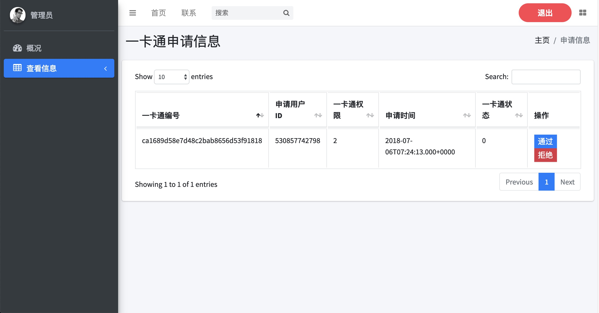

# smartuniversity-server
智慧校园管理系统-服务端
---
### 1. 项目简介
项目基于Intellij Idea开发， JavaWeb实训项目，项目基于[Spring Boot][1]编写了后台接口, 使用[Swagger2][2]编写了简单的接口文档,数据库持久层用的是[MyBatis][3].

### 2. 项目导入
1. `git clone 本项目地址` 到本地, 用Intellij Idea打开
2. 打开项目根目录下的pom.xml依次下载项目依赖即可完成构建
3. 修改application.yml中的数据库及其他配置
4. 前端项目见[smartuniversity-web][4]

### 3. 项目截图

[1]: https://spring.io/projects/spring-boot/
[2]: https://swagger.io/
[3]: https://blog.mybatis.org/
[4]: https://github.com/RITCHIEHuang/smartUniversity-web